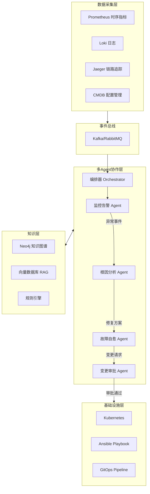

# 多 Agent 智能运维系统 (AIOps) — 面试级全套项目

---

## 一、项目定位与竞争力分析

### 1.1 为什么选这个方向

- 腾讯正在大量招聘「智能运维 AI Agent 平台」岗位（30-60k·15 薪，深圳/北京）
- 核心要求：Go/Python + LLM + Agent 框架 + RAG + K8s + 可观测性
- AI Agent 工程师岗位需求同比增长 380%
- 67% 的大型企业已在生产环境运行自主 AI Agent（2026 年 1 月数据）

### 1.2 参考的企业级开源项目

| 项目 | 定位 | 技术栈 | Stars |
|------|------|--------|-------|
| [Aurora](https://github.com/arvo-ai/aurora) | AI 事件管理平台 | LangGraph + Memgraph 知识图谱 + Weaviate RAG | - |
| [HolmesGPT](https://github.com/holmesgpt/holmesgpt) | CNCF 根因分析 | Agentic Loop + 多数据源集成 | 2100+ |
| [Microsoft AIOpsLab](https://github.com/microsoft/AIOpsLab) | AIOps Agent 评测框架 | Python + 微服务故障注入 | 843 |
| [Kubernaut](https://github.com/jordigilh/kubernaut) | K8s 告警到修复闭环 | LLM + kubectl + 审批门控 | - |
| [Self-Healing SRE Agent](https://github.com/jalpatel11/Self-Healing-SRE-Agent) | 自愈 SRE | LangGraph + GitHub PR 自动创建 | - |

---

## 二、系统架构设计

### 2.1 整体架构（事件驱动 + 多 Agent 协作）



### 2.2 四大 Agent 职责

- **监控告警 Agent**：时序异常检测（3-sigma / EWMA / Isolation Forest）、告警收敛去噪、告警分级
- **根因分析 Agent**：知识图谱遍历、因果推断、日志模式匹配、多源关联分析
- **故障自愈 Agent**：修复方案匹配、Ansible/K8s 命令执行、回滚验证、安全沙箱
- **变更审批 Agent**：风险评估、影响范围分析（爆炸半径）、人工审批门控、审计日志

### 2.3 技术亮点（面试重点讲）

- **时序分析**：动态阈值 vs 静态阈值，Prophet/LSTM 预测，提前 N 分钟预警
- **知识图谱**：Neo4j 存储服务拓扑 + 依赖关系 + 历史故障，图遍历做根因推理
- **自动修复**：分级策略（L0 自动 / L1 半自动 / L2 人工），安全护栏（dry-run / 熔断器 / 限流）
- **事件驱动**：Kafka 解耦，Agent 间异步通信，支持背压和重试

---

## 三、三语言实现方案

### 3.1 Python 版（推荐首选，生态最好）

- **Agent 框架**：LangGraph（图状态机，生产级检查点）
- **时序分析**：Prophet + scikit-learn（Isolation Forest）
- **知识图谱**：Neo4j + py2neo
- **向量数据库**：ChromaDB / Weaviate
- **事件总线**：Kafka（confluent-kafka-python）
- **API 层**：FastAPI
- **容器化**：Docker + docker-compose

### 3.2 Java 版（大厂后端岗最匹配）

- **Agent 框架**：Spring AI + 自建 Agent 编排器（状态机模式）
- **时序分析**：Apache Commons Math + 自实现 EWMA
- **知识图谱**：Neo4j Java Driver + Spring Data Neo4j
- **事件总线**：Spring Cloud Stream + Kafka
- **API 层**：Spring Boot 3
- **设计模式**：策略模式（Agent 选择）、观察者模式（事件）、责任链模式（审批）

### 3.3 Go 版（云原生 / 运维平台岗匹配）

- **Agent 框架**：自建轻量 Agent 框架（channel + goroutine 编排）
- **时序分析**：gonum + 自实现算法
- **知识图谱**：Neo4j Go Driver
- **事件总线**：sarama（Kafka Go client）
- **API 层**：Gin / Echo
- **并发模型**：goroutine + channel（天然适合 Agent 间通信，面试高亮）

---

## 四、项目目录结构

```
multi-agent-aiops/
├── README.md                          # 项目总览（中英文）
├── docs/
│   ├── architecture.md                # 架构设计文档
│   ├── interview/
│   │   ├── resume-template.md         # 简历模板
│   │   ├── star-method.md             # STAR 法则话术
│   │   ├── interview-qa.md            # 面试 Q&A 100 问
│   │   └── baguwen.md                 # 八股文（分布式/Agent/时序/图）
│   └── tutorial/
│       ├── 01-getting-started.md      # 从 0 开始
│       ├── 02-event-driven.md         # 事件驱动详解
│       ├── 03-agent-design.md         # Agent 设计详解
│       ├── 04-knowledge-graph.md      # 知识图谱详解
│       └── 05-deploy.md              # 部署与运维
├── python/                            # Python 实现
│   ├── agents/
│   │   ├── monitor_agent.py
│   │   ├── rca_agent.py
│   │   ├── heal_agent.py
│   │   └── change_agent.py
│   ├── core/
│   │   ├── orchestrator.py
│   │   ├── event_bus.py
│   │   └── knowledge_graph.py
│   ├── models/
│   │   └── time_series.py
│   ├── docker-compose.yml
│   └── requirements.txt
├── java/                              # Java 实现
│   ├── src/main/java/com/aiops/
│   │   ├── agent/
│   │   ├── core/
│   │   ├── model/
│   │   └── config/
│   ├── pom.xml
│   └── Dockerfile
└── golang/                            # Go 实现
    ├── cmd/
    ├── internal/
    │   ├── agent/
    │   ├── core/
    │   ├── model/
    │   └── eventbus/
    ├── go.mod
    └── Dockerfile
```

---

## 五、面试全套准备

### 5.1 简历写法（项目经历部分）

```
多 Agent 智能运维系统 (AIOps)                         2025.xx - 2026.xx
技术栈：Python/LangGraph + Kafka + Neo4j + Prometheus + Docker

- 设计并实现基于事件驱动架构的多 Agent 协作系统，包含监控告警、
  根因分析、故障自愈、变更审批 4 个专业 Agent
- 基于 Neo4j 知识图谱构建服务拓扑依赖关系，实现图遍历根因推理，
  MTTR 从 40min 降至 5min
- 实现基于 Prophet + Isolation Forest 的动态阈值异常检测，告警
  准确率提升至 92%，误报率降低 85%
- 设计分级自愈策略（L0/L1/L2）配合安全护栏机制（dry-run/熔断器），
  自动修复覆盖率达 60%+ 的常见故障
```

### 5.2 STAR 法则话术示例

**S（情景）**：在公司的微服务架构下，运维团队每天处理 200+ 告警，其中 70% 是误报或重复告警，MTTR 平均 40 分钟，人力成本巨大。

**T（任务）**：设计一个多 Agent 智能运维系统，实现告警自动收敛、智能根因定位和故障自动修复，将 MTTR 降低到 5 分钟以内。

**A（行动）**：
- 采用事件驱动架构，用 Kafka 作为 Agent 间消息总线，解耦各环节
- 用 LangGraph 构建 Agent 编排状态机，实现条件路由和检查点恢复
- 用 Neo4j 知识图谱存储服务拓扑，通过图遍历算法定位故障传播链
- 设计三级自愈策略，L0 全自动（重启 Pod），L1 半自动（需确认），L2 人工介入
- 加入 dry-run、熔断器、爆炸半径评估等安全护栏

**R（结果）**：
- MTTR 从 40min 降至 5min（降低 87%）
- 告警噪音降低 85%
- 常见故障自动修复覆盖率 60%+
- 运维人力成本降低约 40%

### 5.3 八股文核心考点（部分列举）

- **事件驱动 vs 请求驱动**：解耦、异步、背压处理、最终一致性
- **Agent 编排模式**：Orchestrator vs Choreography，状态机 vs DAG
- **时序异常检测**：3-sigma / EWMA / Isolation Forest / LSTM 各自适用场景
- **知识图谱根因推理**：图遍历算法、PageRank 变体、贝叶斯网络
- **Kafka**：分区、消费组、Exactly-Once 语义、背压
- **分布式一致性**：CAP、最终一致性、Saga 模式
- **LLM Agent**：ReAct 范式、Tool Calling、Prompt Engineering、RAG
- **安全护栏**：沙箱执行、权限控制、RBAC、审计日志

### 5.4 高频面试问题预设

- "为什么选择事件驱动而不是 RPC？" → 解耦、可扩展、背压
- "Agent 之间如何协作？" → 状态机编排 + 消息总线 + 共享知识层
- "知识图谱怎么构建的？节点和边分别是什么？" → 服务/Pod/指标 为节点，依赖/调用/影响 为边
- "时序异常检测怎么做的？" → 动态阈值（Prophet 预测 + 残差分析），Isolation Forest 多维异常
- "故障自愈安全性怎么保证？" → 分级策略 + dry-run + 熔断器 + 爆炸半径评估 + 审批门控
- "这个项目最大的难点是什么？" → Agent 间状态一致性 + 长任务可靠性 + 误操作防护

---

## 六、实施计划

分三个阶段交付，优先 Python 版（生态最完善、面试可快速 Demo），再补 Java 和 Go 版。

### 阶段一：核心框架 + Python 实现
- 项目骨架搭建（目录结构、README、docker-compose）
- 事件总线核心（Kafka producer/consumer 封装）
- 4 个 Agent 核心逻辑实现
- Agent 编排器（Orchestrator）
- 知识图谱模块（Neo4j 操作封装）
- 时序异常检测模块

### 阶段二：Java + Go 实现
- Java 版：Spring Boot + Spring AI 架构
- Go 版：Gin + goroutine/channel 架构
- 三版统一的 API 接口设计

### 阶段三：文档 + 面试材料
- 架构设计文档（含 Mermaid 图）
- 面试八股文 100 问
- 简历模板
- STAR 法则话术脚本
- 代码逐行讲解教程（从 0 到部署）
